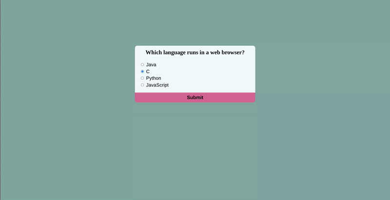

# 🧠 Simple Quiz App

A beginner-friendly, fully functional quiz web app built with **HTML**, **CSS**, and **Vanilla JavaScript** — no frameworks or libraries required.

The best part? 🎉 You can use **unlimited quizzes** — just add your questions to the `data.js` file!

---

## 📸 Demo



---

## 🚀 Getting Started

Clone or download the project to your local machine:

```bash
git clone https://github.com/your-username/simple-quiz-html.git
cd simple-quiz-html
```
---

## ✨ Features

1.Clean, responsive quiz layout

2.Radio button selection for MCQs

3.Score tracking and result display

4.Dynamic question loading

5.No frameworks or libraries

6.The best part: unlimited quizzes just by adding questions in data.js 🎉

